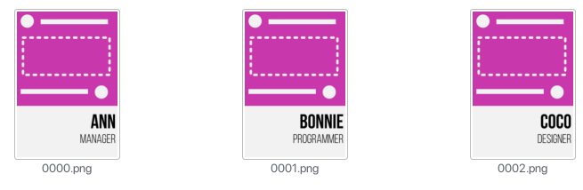

# InkCSV
InkCSV is a program that helps you to make invitations, certificates, name tags, etc. from a CSV file and a SVG template.

I made this program on a GNU/Linux distro, so I don't think it would work on another operating system (like Windows, BSD, or OS X).

## Installation

To run this program, you will need:
- Inkscape
- Python (2.x or 3.x)

To install this program, copy `inkcsv` file to a $PATH directory.

If you have no idea what to do, please type these instructions in terminal:

    sudo apt-get install inkscape python git
    git clone https://github.com/PramastaRR/inkcsv.git
    cd inkcsv
    sudo cp inkcsv /usr/local/bin

## Usage

    inkcsv [CSV file name] [SVG template file name] [Words to replace] [DPI]

- `[CSV file name]`: the data source, on CSV format.
- `[SVG template file name]`: the template, on SVG format.
- `[Words to replace]`: words to replace on the template, please separate each word with comma (,)
- `[DPI]`: DPI of the exported PNG file. Inkscape's default is `96`.

## Example

Case: We are going to make name tags for employees in a company. 

**people.csv**

    Ann, Manager
    Bonnie, Programmer
    Coco, Designer

**template.svg**

With CSV data source and SVG template above, we can make name tags with:

    inkcsv people.csv template.svg var_name,var_role 96

The results will be saved in `exported` directory. The results will look like this:

## Contribution

If you are interested with this project, you can contribute by making pull requests. I need your help to tidy up the code and the documentation!